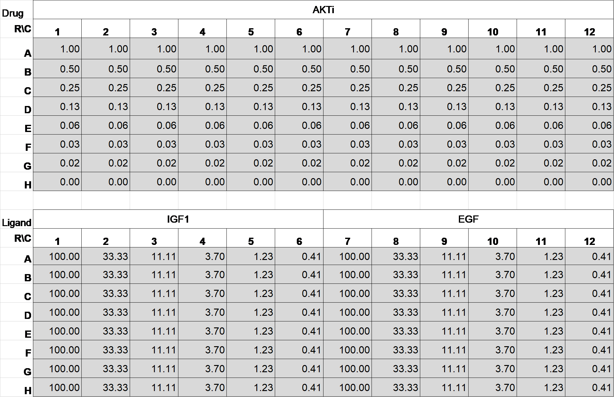
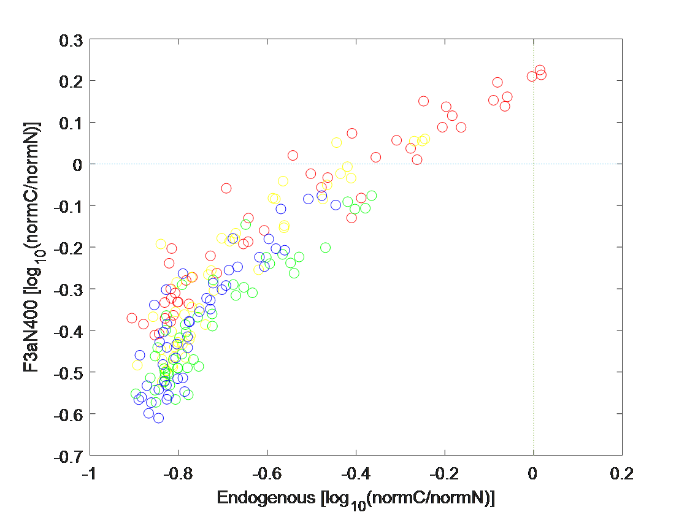
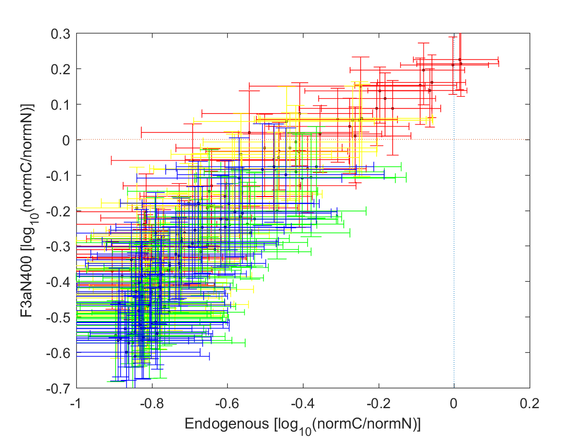

**createParentalVSReporter.m, relates to Fig.1B**

Required input file: combineddata06012014.mat

Cell lines: parental 184A1 and 184A1 with F3aN400 sensor

Treatment Condition: Cells were serum starved for 6 hours, then treated
with combination of drugs and ligands for 0, 15, 45, 90, 135 minutes.
Parental 184A1 cells were immunostained with FoxO3 antibody. Reporter
184A1 cells with F3aN400 sensor were fixed and imaged.

Cell Profiler (Ver:2.1.1) code for image segmentation and data
extraction
  - Rawdata/analysisPipe06012014-parental-withBG.cpproj
  - Rawdata/analysisPipe06012014-reporter-withBG.cpproj

Plate map:

**Each struct timepoint variable contains 8x12 cells following the above
platemap**

Time0: {8×12 cell};Time15: {8×12 cell};Time45: {8×12 cell};Time90: {8×12
cell};Time120: {8×12 cell}

**Each cell contains the following data fields:**

'nuc\_area' 'nuc\_coordX' 'nuc\_coordY' 'nuc\_formfactor'
'nuc\_integratedDAPI' 'nuc\_integratedFoxO3' 'nuc\_integratedWCDGreen'
'nuc\_meanDAPI' 'nuc\_meanFoxO3' 'nuc\_meanWCDGreen'
'nuc\_normmeanFoxO3' 'log10CoverN\_extended\_norm'
'log10CoverN\_extended' 'log10CoverN\_4pixel\_norm'
'log10CoverN\_4pixel' 'extendedcyto\_area'
'extendedcyto\_integratedDAPI' 'extendedcyto\_integratedFoxO3'
'extendedcyto\_integratedECDGreen' 'extendedcyto\_meanDAPI'
'extendedcyto\_meanFoxO3' 'extendedcyto\_meanWCDGreen' 'smallcyto\_area'
'smallcyto\_integratedDAPI' 'smallcyto\_integratedFoxO3'
'smallcyto\_integratedWCDGreen' 'smallcyto\_meanDAPI'
'smallcyto\_meanFoxO3' 'smallcyto\_meanWCDGreen'

**Output figures**

Fig.1B

Show Median alone for all conditions at different time points

Show Median with IQR as error bars

