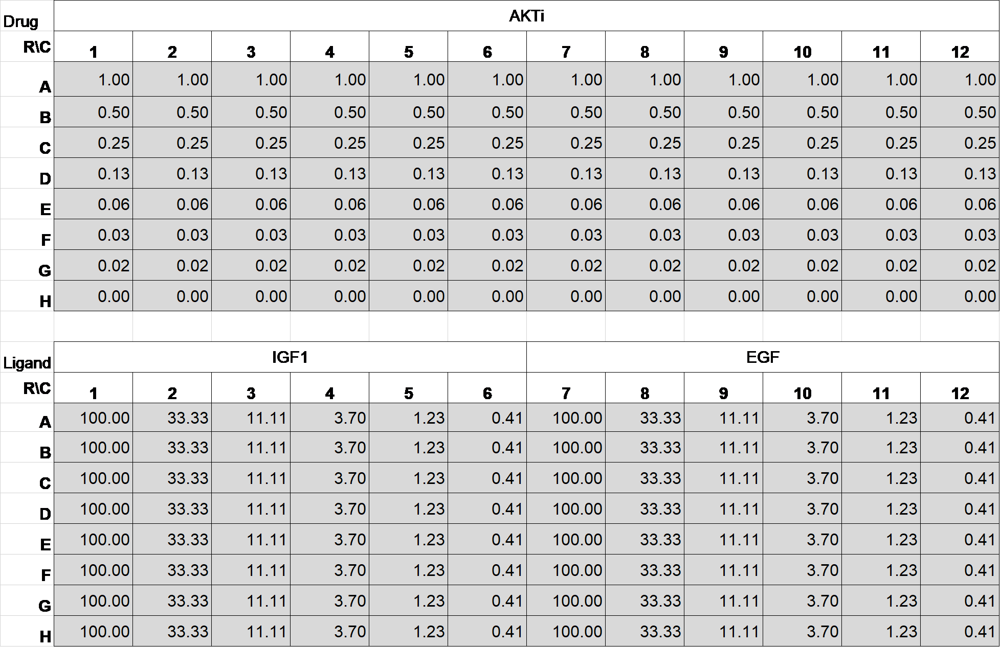

 **Filename:** Combineddata06012014.zip 
 
 **DOI:** 10.6084/m9.figshare.5965852

 **Experimental Setup:**
Cells were serum starved for 6 hours, then treated with combination of
drugs and ligands for 0, 15, 45, 90, 120 minutes.  Parental 184A1 cells
were immunostained with FoxO3 antibody.  Engineered 184A1 cells with
F3aN400 sensor were fixed and directly imaged.

**File Content:**
Combineddata06012014.mat accompanies Fig.1B, S1B and S1C of
Sampattavanich et al., Cell Systems (2018). The file contains two
variables: *reporter* and *parental*, each contains data from 5
timepoints. Each variables contain timepoint struct variables, each with
8x12 cells following the platemap below.

Timepoint: Time0: {8×12 cell};Time15: {8×12 cell};Time45: {8×12
cell};Time90: {8×12 cell};Time120: {8×12 cell}

Available data fields within each cell includes:

'nuc\_area' 'nuc\_coordX' 'nuc\_coordY' 'nuc\_formfactor'
'nuc\_integratedDAPI' 'nuc\_integratedFoxO3' 'nuc\_integratedWCDGreen'
'nuc\_meanDAPI' 'nuc\_meanFoxO3' 'nuc\_meanWCDGreen'
'nuc\_normmeanFoxO3' 'log10CoverN\_extended\_norm'
'log10CoverN\_extended' 'log10CoverN\_4pixel\_norm'
'log10CoverN\_4pixel' 'extendedcyto\_area'
'extendedcyto\_integratedDAPI' 'extendedcyto\_integratedFoxO3'
'extendedcyto\_integratedECDGreen' 'extendedcyto\_meanDAPI'
'extendedcyto\_meanFoxO3' 'extendedcyto\_meanWCDGreen' 'smallcyto\_area'
'smallcyto\_integratedDAPI' 'smallcyto\_integratedFoxO3'
'smallcyto\_integratedWCDGreen' 'smallcyto\_meanDAPI'
'smallcyto\_meanFoxO3' 'smallcyto\_meanWCDGreen'

